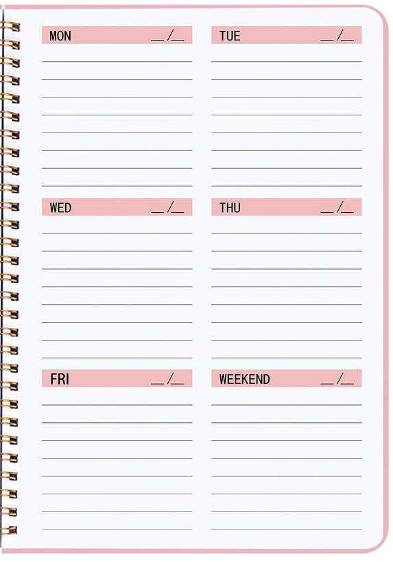
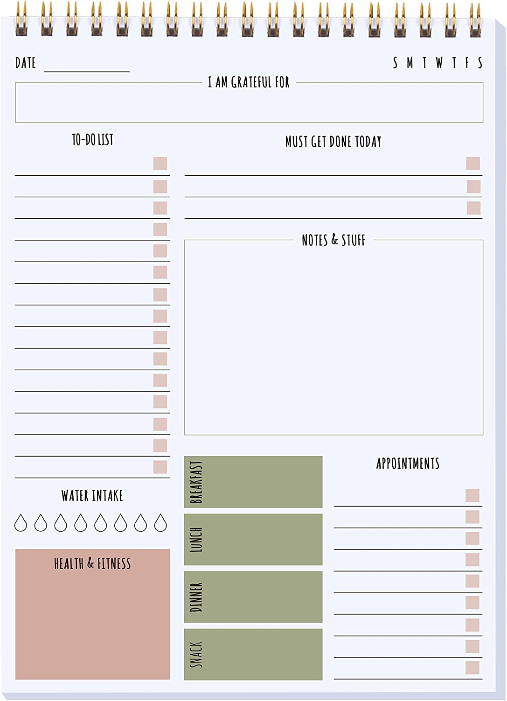

# planrbot
A personal planner app

# To Do
### Blazor
- [x] Implement delete in DayListCard
- [ ] Add dropzone support to DayListCard [see here](https://mudblazor.com/components/dropzone#api)
- [x] Implement basic create in DayListCard
- [ ] Add autocomplete to DayListCard [see here](https://mudblazor.com/components/autocomplete#api)
### Server
- [ ] Setup OAuth plumbing to work with any OAuth provier (like Apple, Google, Microsoft, or Discord)
- [ ] Add MFA support, like WebAuthN
- [ ] Setup SignalR hub
### Other Apps
- [ ] Setup Blazor MAUI Project
- [ ] Setup TVOS project on mac

# Developer Setup
- Install the .NET 7.0.201 SDK [https://dotnet.microsoft.com/en-us/download/dotnet/thank-you/sdk-7.0.201-windows-x64-installer](here)
- Open in VS 2022
- Set "Planrbot.Server" as your startup project
- Select "https (blazor)" from the debug menu to launch the server and blazor

# Design Ethos
- Open source, self-hostable, paid public hosting.
- It should feel fun and rewarding, above all else.
- It should be simple - no tags, extra fields, or big forms.
- It must be convenient and quick to view and complete tasks.
- Target users: neurodiverse people, kids, or anyone that wants easy planning and fun feedback

# Mascot Ideas
- Would a mascot be useful?
- A cute little robot pal that celebrates when you complete tasks
- Maybe it eats completed tasks? And it likes to be fed multiple times a day?
- It would be interesting to have it in a corner, constantly emoting and reacting as you add and complete tasks
- CRITICAL: It should only CELEBRATE with the user. It MUST express either neutral or happy emotion. NEVER negativity or shame.

# UI Thoughts
- It should look like a plain ol' planner. Something like [this](https://m.media-amazon.com/images/I/81C3FUIA8nL.jpg)
- Maybe even have 
- Several iOS apps have nice, plain weekly planner UIs
  - https://apps.apple.com/us/app/weekly-planner-diary-notes/id1187285712
  - https://apps.apple.com/us/app/planner-daily-weekly-calendar/id1538190047
- What about a retro 90's PDA UX? It'd appeal to a certain kind of dork. It's also a UI with a vertical aspect ratio. Making it perfect to adapt to a mobile UI or sidebar UI.

# Devices
- Web via Blazor
- iOS/Android via Blazor MAUI
- Apple TV, with real-time integration

# Beyond Initial Scope
- GDPR / CCPA compliant
- Import/Export
    - Initially just to files. Maybe in markdown, json, or plaintext
- Syncing support to Apple Reminders (via applescript agent?), Google Calendar, etc
- IFTTT-like integration for completing or adding tasks

# Apple Reminders Syncing Notes
- No REST API available
- [https://developer.apple.com/documentation/eventkit](EventKit SDK Details)
- Will need native app for syncing via EventKit

# Templates
What if the UX is customizable, and allows users to make a template like the screenshot below. There could be many different templates to choose from. 

This would be just like shopping for planners at a store. Different styles and templates to choose from.

